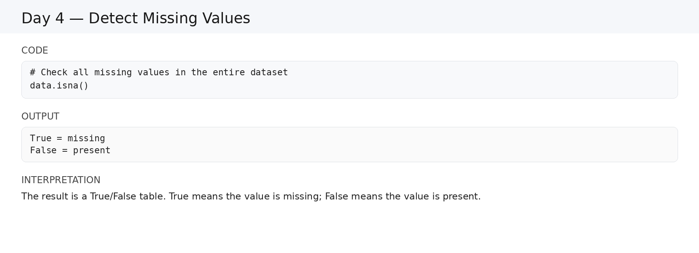
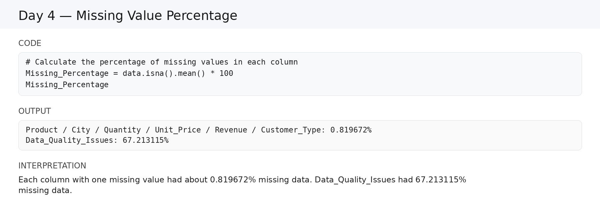
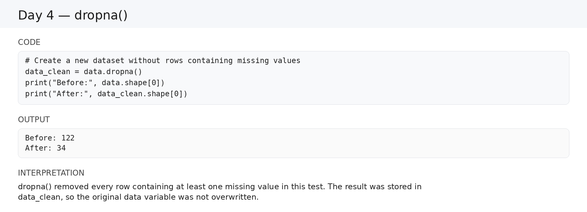
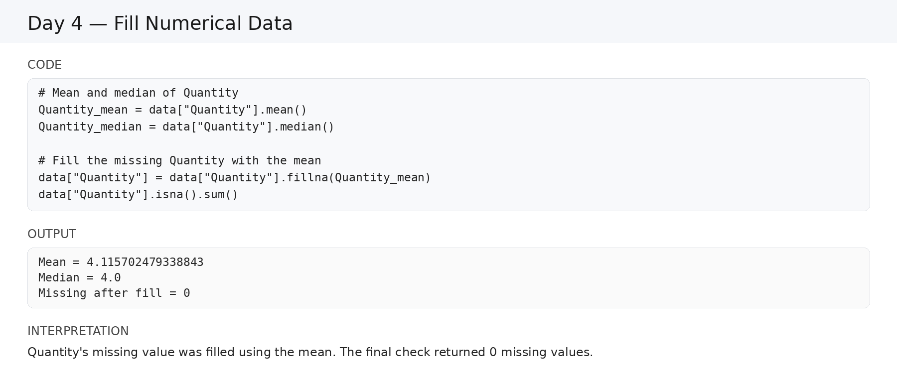
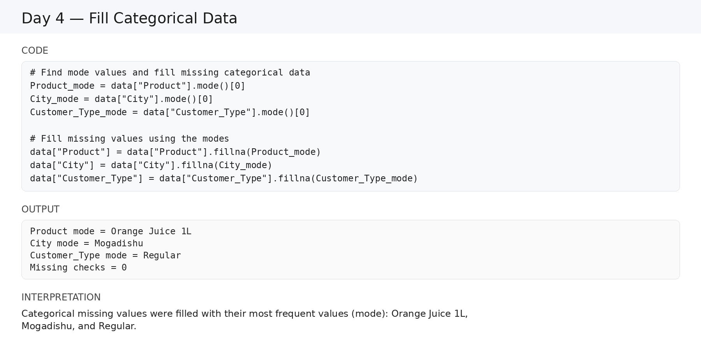
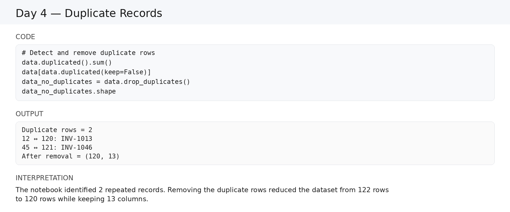

# Day 4 — Data Cleaning with Pandas

## Overview

Day 4 focused on **missing values and duplicate records** using the supermarket practice dataset.

- Dataset at the start: **122 rows × 13 columns**
- Main topics: missing-value detection, missing-value percentages, mode, deleting/filling missing values, and duplicate records.
- The screenshots below are included directly in this README so the learning record is easy to review.

---

## 1. Detect Missing Values

```python
# Check all missing values in the entire dataset
data.isna()
```

`True` means the value is missing and `False` means the value is present.



**Screenshot explanation:** The screenshot demonstrates the Boolean missing-value check.

---

## 2. Count Missing Values

```python
# Count the number of missing values in each column
Missing_Data = data.isnull().sum()

Missing_Data
```

The notebook recorded missing values in Product, City, Quantity, Unit_Price, Revenue, and Customer_Type, plus many missing values in Data_Quality_Issues.


**Screenshot explanation:** The screenshot shows how `sum()` turns the Boolean missing-value results into counts.

---

## 3. Missing Value Percentage

```python
# Calculate the percentage of missing values in each column
Missing_Percentage = data.isna().mean() * 100

Missing_Percentage
```

The columns with one missing value each had about `0.819672%` missing data. `Data_Quality_Issues` had `67.213115%`.



**Screenshot explanation:** The screenshot demonstrates converting the missing-value proportion into a percentage.

---

## 4. Mode and Count

```python
# Get the mode and count for City
mode = data["City"].mode()[0]
count = data["City"].value_counts()[mode]

print("Column:", "City")
print("Mode:", mode)
print("Count:", count)
```

Recorded result:

```text
Column: City
Mode: Mogadishu
Count: 38
```


**Screenshot explanation:** The screenshot shows how the most frequent categorical value is identified and counted.

---

## 5. Delete vs Fill

Before changing missing values, rows containing missing data were inspected:

```python
# Show rows with at least one missing value
data[data.isna().any(axis=1)]
```

Two approaches were studied:

- **Delete** → remove rows containing missing values.
- **Fill** → keep rows and replace missing values with a reasonable value.

---

## 6. Removing Missing Rows with `dropna()`

```python
# Create a new dataset without rows containing missing values
data_clean = data.dropna()

# Compare the number of rows before and after cleaning
print("Before:", data.shape[0])
print("After:", data_clean.shape[0])
```

Recorded result:

```text
Before: 122
After: 34
```



**Screenshot explanation:** The screenshot demonstrates that `dropna()` can remove many rows when missing data is present. The original `data` variable was not overwritten in this test.

---

## 7. Filling Numerical Data — Mean and Median

For numerical columns, the lesson practiced mean and median.

```python
# Get the mean and median of Quantity
Quantity_mean = data["Quantity"].mean()
Quantity_median = data["Quantity"].median()

Quantity_mean
Quantity_median
```

Recorded values:

```text
Mean   = 4.115702479338843
Median = 4.0
```

The missing Quantity value was filled using the mean:

```python
# Fill missing Quantity using the mean
data["Quantity"] = data["Quantity"].fillna(Quantity_mean)

# Check whether Quantity still has missing values
data["Quantity"].isna().sum()
```

Recorded check:

```text
0
```

`Unit_Price` was also practiced:

```text
Mean   = 2.5289256198347108
Median = 2.11
```



**Screenshot explanation:** The screenshot summarizes the numerical filling process using mean and median.

---

## 8. Filling Categorical Data — Mode

Categorical columns were filled with their most frequent value.

### Product

```python
# Find and use the Product mode
Product_mode = data["Product"].mode()[0]
data["Product"] = data["Product"].fillna(Product_mode)
```

Mode:

```text
Orange Juice 1L
```

### City

```python
# Find and use the City mode
City_mode = data["City"].mode()[0]
data["City"] = data["City"].fillna(City_mode)
```

Mode:

```text
Mogadishu
```

### Customer_Type

```python
# Find and use the Customer_Type mode
Customer_Type_mode = data["Customer_Type"].mode()[0]
data["Customer_Type"] = data["Customer_Type"].fillna(Customer_Type_mode)
```

Mode:

```text
Regular
```

The missing-value checks returned `0`.



**Screenshot explanation:** The screenshot shows the mode-based strategy used for categorical columns.

---

## 9. Why Not `fillna(0)` Everywhere?

`0` should not automatically replace every missing value.

Examples:

- A missing `City` should not become `0`.
- A missing `Product` should not become `0`.
- A numerical value may need a mean or median instead of `0`.

The rule practiced in Day 4 was:

```text
Numerical data    → Mean / Median
Categorical data  → Mode
```

---

## 10. Duplicate Records

Duplicates are repeated records.

```python
# Count duplicate rows
data.duplicated().sum()
```

Recorded result:

```text
2
```

To see all members of duplicate groups:

```python
# Show all rows belonging to duplicate groups
data[data.duplicated(keep=False)]
```

The notebook identified:

- Row `12` ↔ Row `120` → `INV-1013`
- Row `45` ↔ Row `121` → `INV-1046`



**Screenshot explanation:** The screenshot shows duplicate detection and the final duplicate-removal result.

---

## 11. Remove Duplicate Records

```python
# Remove duplicate rows and create a new dataset
data_no_duplicates = data.drop_duplicates()

# Check the new shape
data_no_duplicates.shape
```

Recorded result:

```text
(120, 13)
```

Calculation:

```text
122 original rows
- 2 duplicate rows
= 120 rows
```

The dataset still has 13 columns.

---

# Day 4 Final Summary

| Skill | Pandas |
|---|---|
| Detect missing values | `isna()`, `isnull()` |
| Count missing values | `sum()` |
| Missing percentage | `mean() * 100` |
| Find most common value | `mode()` |
| Count frequencies | `value_counts()` |
| Show rows with missing values | `isna().any(axis=1)` |
| Remove rows with missing values | `dropna()` |
| Fill missing values | `fillna()` |
| Detect duplicates | `duplicated()` |
| Count duplicates | `duplicated().sum()` |
| Remove duplicates | `drop_duplicates()` |
| Select first positional mode | `iloc[0]` |

## Day 4 Workflow

```text
Detect missing values
        ↓
Count missing values
        ↓
Calculate missing percentages
        ↓
Inspect missing rows
        ↓
Choose Delete or Fill
        ↓
Fill numerical data
        ↓
Fill categorical data
        ↓
Detect duplicates
        ↓
Remove duplicate records
```

## Important Data Note

The notebook recorded **82 missing values in `Data_Quality_Issues`**. Those values were not filled in the later steps. Therefore, the notebook did not completely remove every missing value from every column.

---

# Screenshot Index

The README includes all 8 PNG screenshots directly:

1. Detect Missing Values
2. Count Missing Values
3. Missing Value Percentage
4. Mode and Count
5. `dropna()`
6. Numerical Data
7. Categorical Data
8. Duplicate Records
